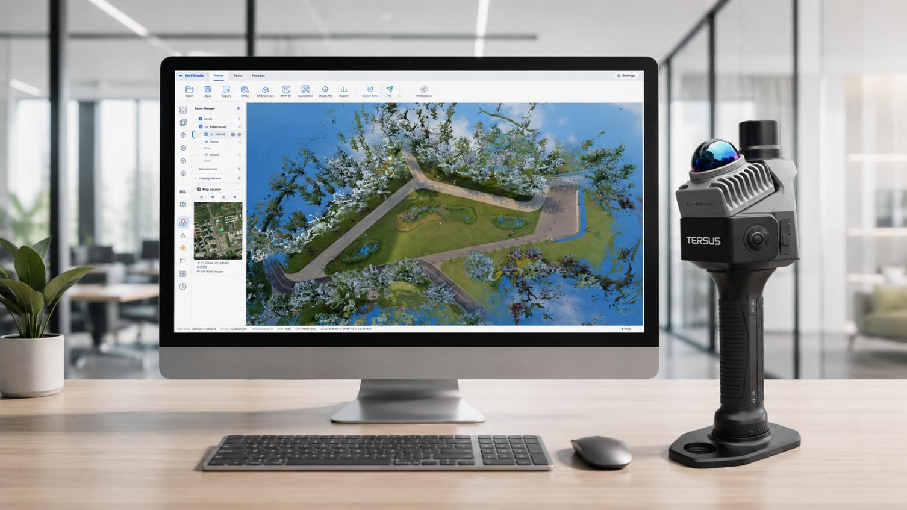
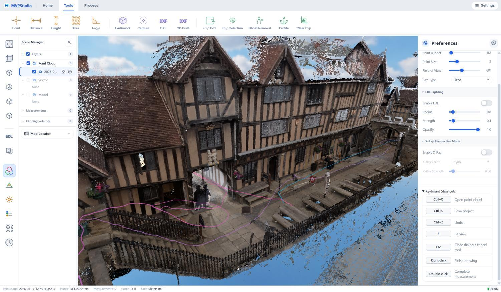
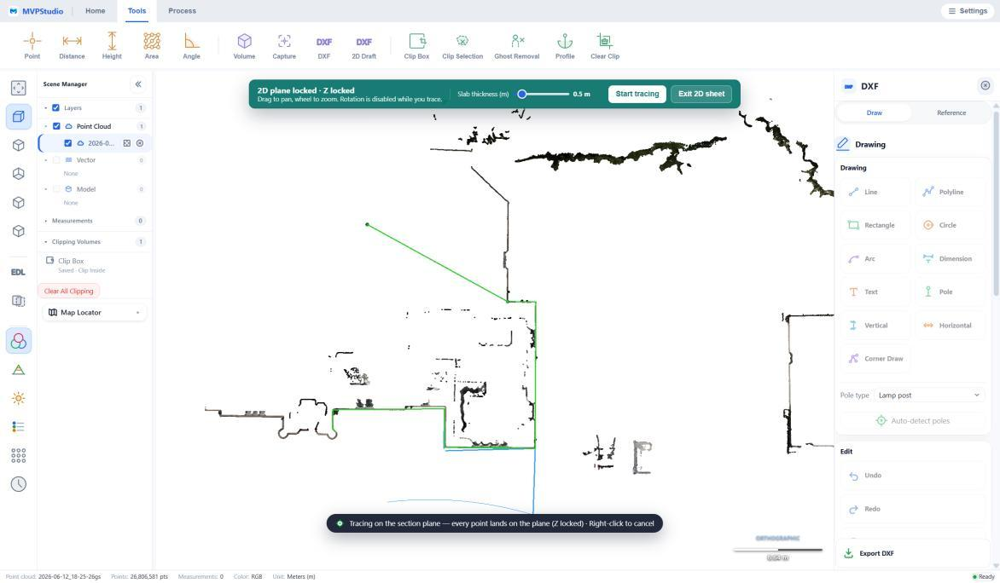
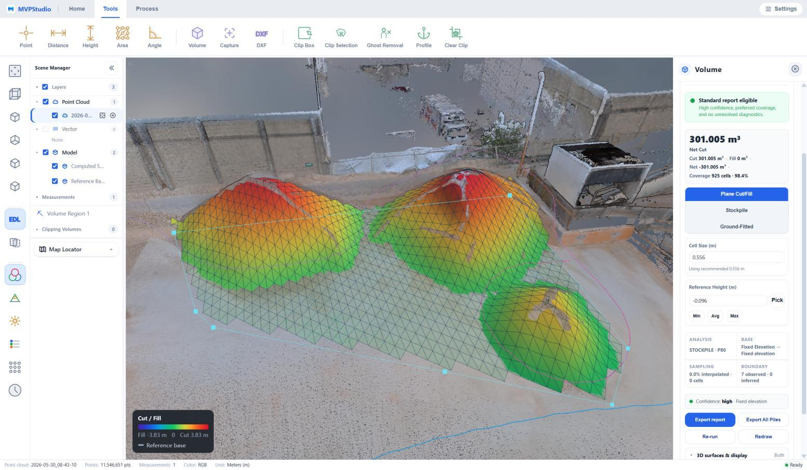
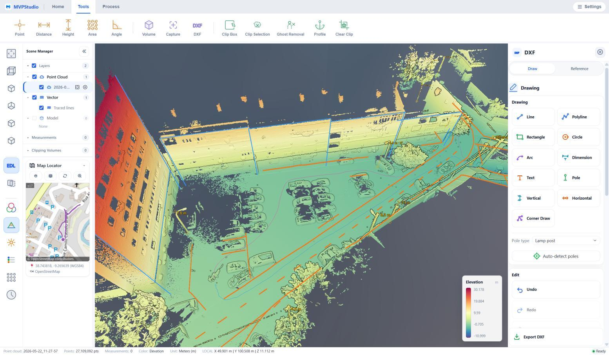

  

<h1 align="center">MVPStudio</h1>

<strong>THE PROFESSIONAL POINT CLOUD PLATFORM</strong>

  Visualize &middot; Measure &middot; Extract &middot; Deliver 
  One offline Windows workflow from raw scan to client-ready CAD, GIS, terrain, and survey reports.

  <a href="https://github.com/yang498-Peter/mvpstudio-releases/releases/download/v1.0.8-rc.1/MVPStudio-Setup-1.0.8-rc.1.exe"><strong>Download MVPStudio V1.0.8 RC</strong></a>
  &nbsp;&middot;&nbsp;
  <a href="https://github.com/yang498-Peter/mvpstudio-releases/releases/tag/v1.0.8-rc.1">Release notes</a>
  &nbsp;&middot;&nbsp;
  <a href="https://github.com/yang498-Peter/mvpstudio-releases/releases/download/v1.0.8-rc.1/MVPStudio-Setup-1.0.8-rc.1.exe.sha256">SHA-256</a>

  

## A scan is not a deliverable

Your client needs the answers inside the point cloud: reliable coordinates, defensible measurements, clean linework, terrain quantities, and files that open in the tools they already use.

MVPStudio brings that workflow into one professional desktop application. Process Tersus MVP S1 projects, work with standard point-cloud formats, inspect large datasets smoothly, measure in the correct coordinate frame, extract CAD and GIS features, and produce reports that document the result. The complete data workflow runs locally on your Windows workstation.

> Your client never paid for a point cloud. They paid for the answer inside it.

## One application. The entire workflow.

| Capture and visualize | Measure and prove | Extract and deliver |
| --- | --- | --- |
| Guided MVP S1 processing, multi-project queues, panorama generation, RGB/elevation/intensity/classification views, EDL, X-Ray, profiles, and basemaps. | Point, distance, height, area, angle, and volume tools; check-point verification; live RMS and deviation statistics; accuracy and transformation reports. | Section Trace, assisted line tracing, full R12 DXF drafting, Shapefile, terrain surfaces, contours, orthophotos, reports, and standard point-cloud exports. |

<table>
  <tr>
    <td width="50%"></td>
    <td width="50%"></td>
  </tr>
  <tr>
    <td align="center"><strong>See and inspect every detail</strong></td>
    <td align="center"><strong>Move from point cloud to coordinate-true CAD</strong></td>
  </tr>
</table>

## Built for professional delivery

- **Survey-grade coordinates** - PROJ-based coordinate conversion, EPSG/PROJ/WKT support, grid files, geoid models, live preview, and a transformation certificate.
- **Measurements that stay stable** - large-coordinate rendering and measurement safeguards, global unit switching, and client-ready QA evidence.
- **Point cloud to CAD and GIS** - section-based tracing, drawing tools, layers, R12 DXF with real coordinates, and ESRI Shapefile output.
- **Terrain and volume** - ground classification, DTM/DSM, contours, cut/fill/net analysis, coverage diagnostics, and PDF reporting.
- **Accountable automation** - Scan Doctor, assisted line trace, floor-plan review, pole and curb workflows, and parameter recommendations with the operator in control.
- **Local and private** - point clouds, panoramas, project files, and reports remain on the workstation; no cloud upload is required for the processing workflow.

  

## Deliverables your client can open

| Point clouds | CAD and GIS | Terrain and imagery | Reports and packages |
| --- | --- | --- | --- |
| LAS, LAZ, E57, PLY, XYZ, PTS | R12 DXF, Shapefile, CSV | GeoTIFF, DTM/DSM, contours, orthophoto, panorama | Accuracy, transformation, processing, volume, and deliverable packages |

MVPStudio is also expanding into mobile laser scanning workflows for roads, rail, utilities, and city surveying, including pole extraction, curb and structure-line tracing, ground classification, intensity rasters, and GIS-ready output.

  

## Current release

| | |
| --- | --- |
| **Version** | MVPStudio V1.0.8 RC |
| **Platform** | Windows 10/11, 64-bit |
| **Installer** | `MVPStudio-Setup-1.0.8-rc.1.exe` |
| **Size** | 1,995,284,795 bytes |
| **SHA-256** | `AB2C4D2A7CAD99874D67B434BB6C7FB878C0062C26AF7366B359CAE7812A4FED` |

This is a release-candidate build. Validate it with representative project data before production use. A modern dedicated GPU and SSD are recommended for large point-cloud projects.

The installer is not yet Authenticode-signed, so Windows SmartScreen may display a warning. Verify the SHA-256 value above before installation.

---

  <strong>Powered by Tersus</strong> 
  Built for the MVP S1 Mobile Mapping System and professional point-cloud delivery.

